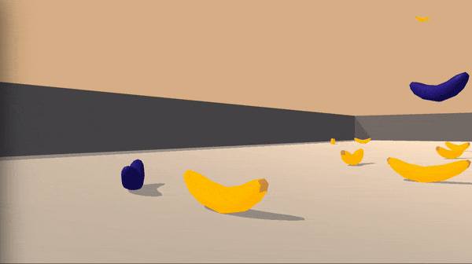

# Project 1 - Navigation - Deep Reinforcement Learning Nanodegree

### Introduction

In this project, we use deep reinforcement learning (specifically variations of DQN) to train an agent to navigate a Unity environment and to collect yellow but not blue bananas.




In the environment, an agent navigates a square world to collect yellow bananas, while avoiding blue bananas. Each yellow banana leads to a reward of +1.0, while each blue banana gives a reward of -1.0. The goal is to achieve an average score of at 13 over 100 consecutive episodes.

The agent observes 37 variables corresponding to its velocity and a ray-based perception of the environment in its forward direction. 

There are four discrete actions: moving forward, moving backward, turning left, and turning right.

### Setup

#### Download and install deepRL-navigation
```
clone git https://github.com/clzuend/deepRL-navigation.git
cd deepRL-navigation
pip install .
```

#### Download the Unity Banana Environment
1. Download the environment from one of the links below.  You need only select the environment that matches your operating system:
    - Linux: [click here](https://s3-us-west-1.amazonaws.com/udacity-drlnd/P1/Banana/Banana_Linux.zip)
    - Mac OSX: [click here](https://s3-us-west-1.amazonaws.com/udacity-drlnd/P1/Banana/Banana.app.zip)
    - Windows (32-bit): [click here](https://s3-us-west-1.amazonaws.com/udacity-drlnd/P1/Banana/Banana_Windows_x86.zip)
    - Windows (64-bit): [click here](https://s3-us-west-1.amazonaws.com/udacity-drlnd/P1/Banana/Banana_Windows_x86_64.zip)
    
2. Place the file in the project folder. 

3. Depending on your operating system you might have to change the ``BANANA_PATH`` in  `Navigation_DQN.ipynb`. 

### Instructions

Open the `Navigation_DQN.ipynb` workbook to initiate the environment and train the agents.

The ``Agent`` class currently supports three types of agents that can be passed using the ``flavor`` parameter:
- ``plain``: Standard DQN agent.
- ``double``: Double DQN agent.
- ``dueling``: Dueling DQN agent.
- ``double-dueling``: Double dueling DQN agent

```python
agent = Agent(state_size=state_size, action_size=action_size, seed=0, hidden_sizes = [64, 64], flavor='plain')
```

The ``Agent`` class additionally has a ``show_network()`` method to visualize the graph of the network:
```python
agent.agent.show_network()
```

The number of layers (at least one) and their neurons can be passed in a list to the ``hidden_sizes`` parameter. The default is ``hidden_sizes = [64,64]``, i.e., two layers with 64 neurons each.

Additional information can be found in the project report: `Report.pdf`
